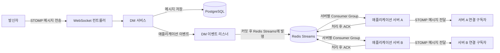
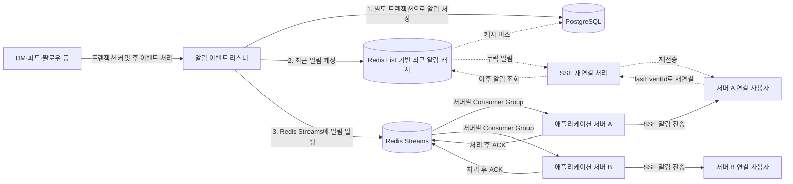
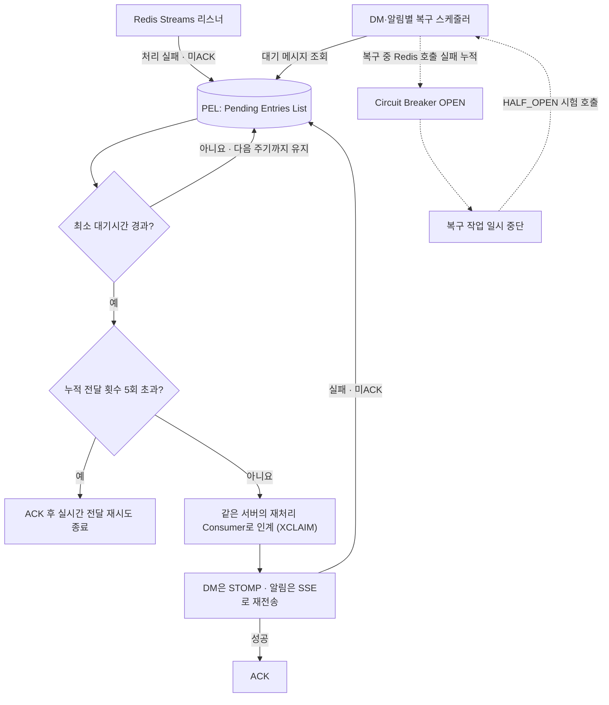

# 🧥 옷장을 부탁해 (Otboo)

> 날씨·취향 기반 의상 조합 추천 + OOTD 피드 소셜 서비스 \
> 팀 프로젝트 종료 후 성능 검증을 통해 오류를 발견·수정하고, 병목을 분석해 구조적 개선 방향을 도출한 개인 고도화 포크

[](https://openjdk.org/)
[](https://spring.io/projects/spring-boot)

🎬 [팀 프로젝트 시연 영상](https://drive.google.com/file/d/15Aw6SN9HEt85HFxmfV5XhMdY0WsPqMJM/view)  | 
🗒️ [개발 리포트](https://www.notion.so/312203c86c5980dbafc7f1961b01eda4)  |
🔍 [팀 프로젝트 SonarQube Cloud · Test Coverage 83.3%](https://sonarcloud.io/component_measures?metric=coverage&id=codeit-team2-advanced-project_sb06-otboo-team2)  | 


> 원본 프로젝트: [codeit-team2-advanced-project/sb06-otboo-team2](https://github.com/codeit-team2-advanced-project/sb06-otboo-team2) \
> 팀 프로젝트: 5인, 2026.01.22 ~ 02.27 \
> 개인 고도화: 2026.07 ~

---

## 🙋 담당 기능 요약

팀 프로젝트에서 **실시간 DM 및 알림 시스템**을 담당했습니다.

| 담당 영역 | 핵심 기술·구현 |
| --- | --- |
| 실시간 1:1 DM | WebSocket · Redis Streams · 다중 서버 전달 |
| 실시간 알림 | SSE · Redis Streams · 재연결 보정 |
| 알림 통계 배치 | Spring Batch · ShedLock |
| 장애 대응 | Resilience4j Circuit Breaker |

---

## 🏗️ 시스템 아키텍처

> 

---

## 🔄 핵심 처리 흐름

### 실시간 DM 처리 흐름

메시지는 먼저 PostgreSQL에 저장합니다. 트랜잭션 커밋 후 Redis Streams에 발행하고, 각 애플리케이션 서버가 독립된 Consumer Group으로 메시지를 수신하여 해당 서버에 연결된 구독자에게 전달합니다.



### 실시간 알림 및 재연결 보정 흐름

도메인 트랜잭션이 커밋되면 알림을 별도 트랜잭션으로 생성합니다. 재연결 보정을 위해 사용자별 최근 알림을 Redis List에 최대 50개, 5일 TTL로 캐시한 뒤 Redis Streams로 발행합니다. 각 서버는 자신에게 연결된 사용자에게 SSE로 알림을 전송하며, 재접속 시에는 `lastEventId` 이후의 누락 알림을 다시 전송합니다. 캐시 미스 시에는 PostgreSQL에서 최근 알림을 조회해 캐시를 복구합니다.



> 위 다이어그램은 정상 처리 및 재연결 흐름을 나타냅니다. PEL 기반 실패 재처리는 아래에서 확인할 수 있습니다.

<details>
<summary>Redis Streams PEL 기반 실패 복구 흐름 보기</summary>



> **재처리 정책과 보장 범위:** PostgreSQL을 메시지의 원본 저장소로 두고 Redis Streams는 서버 간 실시간 전달에 사용합니다. 일시적인 전달 실패는 PEL에서 재처리하지만, 반복 실패 이벤트는 원본 데이터가 DB에 남아 있으므로 별도 DLQ로 격리하지 않고 누적 전달 횟수가 5회를 초과하면 ACK 처리해 PEL 누적을 방지했습니다. 따라서 Redis 장애나 WebSocket·SSE 연결 단절 중 실시간 전달은 보장하지 않습니다. 이때 DM은 이후 채팅방 조회로, 알림은 SSE 재연결 시 Redis List 또는 DB에서 확인할 수 있습니다.

</details>

---

## 🔍 핵심 구현과 문제 해결

> 아래는 대표적인 구현·문제 해결 사례이며, [개발 리포트](https://www.notion.so/312203c86c5980dbafc7f1961b01eda4)에는 기술 선택 근거와 검증 과정, 그 외 구현·개선 내용을 함께 정리했습니다. 

### 팀 프로젝트 구현

- [다중 서버 실시간 메시징](https://app.notion.com/p/312203c86c5980dbafc7f1961b01eda4?source=copy_link#3bb203c86c59806d9054cad610599a14): 서버별 로컬 연결로 다른 서버의 사용자에게 DM·알림을 전달할 수 없음 → 사용자-서버 연결 위치를 별도 관리하는 대신 Redis Streams로 모든 서버에 메시지를 공유하고 해당 사용자가 연결된 서버에서만 최종 전송
- **Redis Streams 선택·실패 재처리 및 장애 대응**: [메시지 브로커 선택](https://app.notion.com/p/312203c86c5980dbafc7f1961b01eda4?source=copy_link#3bb203c86c5980f4ae68c13faaa6d41d)에서 Consumer 처리 확인과 실패 재처리를 기준으로 Redis Streams 선택 → [재처리·장애 대응](https://app.notion.com/p/312203c86c5980dbafc7f1961b01eda4?source=copy_link#3bb203c86c5980f0b479f9c41a95c359)에서 ACK·PEL 기반 재처리 스케줄러와 Circuit Breaker 적용
- **테스트 검증**: 핵심 비즈니스 로직은 Mockito 기반 단위 테스트, JPA Repository와 Redis 관련 동작은 슬라이스 테스트, 알림 배치 흐름은 통합 테스트로 검증. EasyRandom으로 테스트 데이터 구성

### 개인 고도화 및 검증

- [DM DB 커넥션 풀 병목](https://app.notion.com/p/312203c86c5980dbafc7f1961b01eda4?source=copy_link#3bb203c86c598011a903c678635d1e9a): 부하 증가에 따라 메시지 타임아웃 급증 → 스레드 덤프에서 처리 스레드의 DB 커넥션 대기 확인 → 풀 확대의 한계와 DB 왕복 축소·처리량 제어 방향 도출
- [알림 삭제 배치 구조 개선](https://app.notion.com/p/312203c86c5980dbafc7f1961b01eda4?source=copy_link#3bb203c86c5980f9ab74c3d2026fc93b): Job은 완료됐지만 실제 삭제되지 않는 문제 발견 → UUID 기반 JDBC Paging·Batch DELETE로 변경하고 재시작을 고려한 복합 정렬·날짜 기준 JobParameter 적용 → `EXPLAIN ANALYZE`로 실행 계획을 비교해 복합 인덱스 효과 검증
- [인가 구조 개선](https://app.notion.com/p/312203c86c5980dbafc7f1961b01eda4?source=copy_link#3ca203c86c5980568ce8cfcd6c928a8e): 요청의 userId·authorId·followerId를 신뢰해 타 사용자 리소스를 조작할 수 있는 구조 발견 → 인증된 사용자 ID를 사용하도록 변경하고 수정·삭제 시 소유권 검증 추가 → 통합 테스트로 401/403/204 동작 검증
- [SSE 재연결 알림 유실](https://app.notion.com/p/312203c86c5980dbafc7f1961b01eda4?source=copy_link#3bb203c86c59805e9a44f902fbe9a7c2): 이전 emitter의 지연된 완료 콜백이 새 연결까지 삭제 → `ConcurrentHashMap.remove(key, value)` 적용 → 재연결 재현 테스트로 정상 수신 확인

---

## 📊 성능 측정

| 측정 항목 | 결과 |
|-----------|------|
| WebSocket DM 부하테스트 | **500 → 5,000 VU에서 메시지 타임아웃 15.5% → 95.9%** → 스레드 덤프에서 **216개 처리 스레드의 HikariCP 커넥션 대기** 확인 |
| Redis Streams Consumer 구간 측정 | 앱·DB 경로를 제외하고 Redis Streams에 직접 메시지를 주입한 조건에서 단일 Consumer **약 6,300 msg/sec** 처리 |
| 알림 삭제 Batch Paging 조회 | 47,300건 기준 첫 페이지 조회 **8.056ms → 0.066ms** → `(created_at, id)` 복합 인덱스 적용 후 **Index Only Scan** 전환 |

---

## ✅ 코드 품질 관리

SonarQube를 GitHub Actions와 연동하여 PR 단위로 품질을 자동 검증했습니다.

* **테스트 커버리지 80% 이상** 강제(DTO, config 제외)
* 코드 스멜·보안 취약점 자동 검출
* 빌드 + 테스트 통과를 Merge 조건으로 설정
* 코드 리뷰에서는 기계적 검증을 SonarQube에 맡기고, **도메인 로직 정합성과 설계 개선 제안**에 집중했습니다.

🔗 [SonarQube 대시보드](https://sonarcloud.io/project/overview?id=codeit-team2-advanced-project_sb06-otboo-team2)

---

## 🛠 기술 스택

| 분류             | 기술                                                |
| -------------- | ------------------------------------------------- |
| Language       | Java 17                                           |
| Framework      | Spring Boot 3.5.10, Spring Security, Spring Batch    |
| Database       | PostgreSQL, Redis                                 |
| Messaging      | WebSocket (STOMP), SSE, Redis Streams             |
| Data Access    | Spring Data JPA, QueryDSL                         |
| Cloud          | AWS ECS (Fargate), ECR, RDS, ElastiCache, S3, ALB |
| Load Test      | k6 (WebSocket), xk6-sse (SSE)                     |
| Resilience     | Resilience4j (Circuit Breaker), ShedLock          |
| CI/CD          | GitHub Actions                                    |
| Code Quality   | SonarQube Cloud                                   |
| API Docs       | Swagger (Springdoc)                               |
| Test           | JUnit 5, Mockito, EasyRandom                      |

---

## 🗂️ 프로젝트 구조

도메인별 패키지 안에서 Controller, Service, Repository 계층을 분리하고 있습니다.

```text
src/main/java/codeit/sb06/otboo
├── clothes       # 의상 관리 및 날씨 기반 추천
├── feed          # OOTD 피드
├── comment       # 피드 댓글
├── follow        # 사용자 팔로우
├── message       # WebSocket DM 및 Redis Streams
├── notification  # SSE 알림, Redis Streams 및 배치
├── user          # 사용자 및 인증
├── profile       # 프로필 및 S3 이미지
├── weather       # 날씨·위치 외부 API 연동
├── security      # JWT, OAuth2 및 권한 검증
├── common        # 공통 스트림 복구 스케줄러
├── config        # 애플리케이션 설정
└── exception     # 도메인별 예외 처리
```

---

## 🚀 로컬 실행 방법

### 사전 요구사항

- Docker & Docker Compose

### 실행

```bash
git clone https://github.com/HOGUN00/otboo-advance.git
cd otboo-advance

# 환경변수 설정
cp .env.example .env

# .env.example을 참고해 필요한 환경변수 입력

# PostgreSQL, Redis, 애플리케이션 실행
docker-compose up -d
```

---

## 👤 Author

**이호건**  |  [GitHub](https://github.com/HOGUN00)
