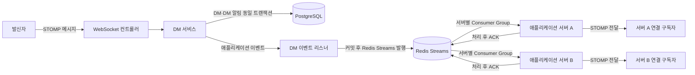

# 🧥 옷장을 부탁해 (Otboo)

> 날씨·취향 기반 의상 조합 추천 + OOTD 피드 소셜 서비스<br>
> 5인 팀에서 **실시간 DM·알림 시스템을 담당**했고, 프로젝트 종료 후 개인 포크에서 **부하 테스트와 오류 재현을 통해 병목과 기존 구현의 문제를 검증·개선**했습니다.

🎬 [팀 프로젝트 시연 영상](https://drive.google.com/file/d/15Aw6SN9HEt85HFxmfV5XhMdY0WsPqMJM/view) |
🗒️ [기술 문서](https://www.notion.so/312203c86c5980dbafc7f1961b01eda4) |
🔍 [SonarQube Cloud · Test Coverage 83.3%](https://sonarcloud.io/component_measures?metric=coverage&id=codeit-team2-advanced-project_sb06-otboo-team2)

> 팀 프로젝트: 5인, 2026.01.22 ~ 02.27<br>
> 개인 고도화: 2026.07 ~ 09<br>
> 원본 프로젝트: [codeit-team2-advanced-project/sb06-otboo-team2](https://github.com/codeit-team2-advanced-project/sb06-otboo-team2)

---

## 🙋 역할

| 구분 | 주요 경험 |
| --- | --- |
| 팀 프로젝트 | WebSocket 1:1 DM · SSE 알림 · Redis Streams 기반 다중 서버 전달·재처리 · 알림 Batch |
| 개인 고도화 | DM 커넥션 병목 분석 · 알림 삭제 Batch 개선 · SSE 재연결 Race Condition · 권한 검증 개선 |

---

## 🔄 핵심 처리 흐름

### 실시간 DM 처리 흐름

DM 요청은 WebSocket으로 수신하고, DM과 DM 알림을 하나의 트랜잭션에서 저장합니다.  
트랜잭션 커밋 후 Redis Streams에 이벤트를 발행하고, 각 애플리케이션 서버가 서버별 Consumer Group으로 수신해 구독자에게 전달합니다.



---

## 🔍 핵심 구현 및 개선

### 1. DM DB 커넥션 병목 분석·개선

**문제**<br>
500 VU 부하에서 HikariCP timeout·waiting 급증

**분석**<br>
스레드 덤프에서 `HikariPool.getConnection()` 대기 확인<br>
→ `AFTER_COMMIT + REQUIRES_NEW`에서 기존 Connection 반환 전 추가 Connection 획득 확인

**개선**<br>
DM·알림 DB 저장을 동일 트랜잭션으로 결합<br>
→ 추가 Connection 획득 구간 제거

**검증**<br>
HikariCP timeout **501 → 0**, max waiting **215 → 0**<br>
지속 부하 60초 기준 **275 msg/s 전부 10초 내 수신**<br>
→ **300 msg/s부터 실패 관찰**

**판단**<br>
외부 큐 비동기화도 검토<br>
→ DM Commit 후 알림 생성 요청 발행에 실패하면 알림이 생성되지 않을 수 있음<br>
→ 현재 범위에서는 **별도 큐 도입보다 DM·알림 DB 저장 정합성 우선**<br>
→ 대신 알림 저장 실패가 DM까지 롤백되는 결합은 감수<br>
→ 향후 Transactional Outbox로 **알림 생성 요청 발행을 보장**한 뒤 알림 처리를 비동기로 분리 가능

🔗 [DM 커넥션 병목 상세](https://app.notion.com/p/312203c86c5980dbafc7f1961b01eda4?source=copy_link#3bb203c86c598011a903c678635d1e9a)

### 2. 다중 서버 실시간 메시징 구조 설계

**제약**<br>
`WebSocketSession`·`SseEmitter`는 각 서버의 로컬 메모리에서 관리<br>
→ 이벤트 발생 서버 ≠ 사용자 연결 서버인 경우 직접 전달 불가

**대안**<br>
사용자-서버 연결 위치 별도 관리<br>
vs<br>
모든 서버에 이벤트 공유 후 각 서버의 로컬 연결 확인

**선택**<br>
Redis Streams로 서버 간 이벤트 공유<br>
→ 서버별 Consumer Group에서 메시지 수신<br>
→ 각 서버의 로컬 연결 확인<br>
→ 대상 사용자에게 최종 전달

**선택 근거**<br>
Redis Pub/Sub · RabbitMQ · Kafka · Redis Streams 비교<br>
→ **Consumer 처리 확인 + 실패 재처리 + 기존 Redis 인프라 활용**

**보장 범위**<br>
Stream에 전달된 뒤 ACK되지 않은 메시지 → PEL에서 추적·재처리<br>
DB Commit 후 실시간 이벤트의 Stream 발행 실패 → 현재 보장하지 않음<br>
→ 원본 데이터는 PostgreSQL에 남으며 이후 조회 가능<br>
→ 실시간 전달까지 보장해야 한다면 Outbox 기반 발행 재시도 적용 가능

🔗 [다중 서버 메시징 상세](https://app.notion.com/p/312203c86c5980dbafc7f1961b01eda4?source=copy_link#3bb203c86c59806d9054cad610599a14)

### 3. 알림 삭제 Batch 구조 개선

**문제**<br>
Batch Job은 `COMPLETED`<br>
→ 실제 알림 데이터는 삭제되지 않음

**원인**<br>
삭제 처리에 사용한 `JpaItemWriter`가 `remove()`가 아닌 `merge()` 수행

**개선**<br>
`JdbcPagingItemReader`로 삭제 대상 UUID 조회<br>
→ `JdbcBatchItemWriter`로 Batch DELETE<br>
→ 재시작을 고려한 `created_at, id` 복합 정렬<br>
→ 날짜 기준 JobParameter 적용

**확인**<br>
실제 삭제 동작 확인<br>
`EXPLAIN ANALYZE`로 Paging 조회 계획 비교<br>
→ 47,300건 기준 첫 페이지 **8.056ms → 0.066ms**<br>
→ `Index Only Scan` 전환

**판단**<br>
엔티티 생명주기 처리가 필요하지 않은 대량 삭제<br>
→ **JDBC Paging + Batch DELETE 선택**

🔗 [알림 삭제 Batch 상세](https://app.notion.com/p/312203c86c5980dbafc7f1961b01eda4?source=copy_link#3bb203c86c5980f9ab74c3d2026fc93b)

---

## 🏗️ 시스템 아키텍처


DM·알림 처리 흐름, PEL 재처리 정책, SSE 재연결 보정, 성능 측정 조건 등은 [기술 문서](https://www.notion.so/312203c86c5980dbafc7f1961b01eda4)에 정리했습니다.

---

## ✅ 협업 및 품질

- GitHub Actions 기반 PR 빌드·테스트·정적 분석 자동화
- SonarQube Cloud Test Coverage **83.3%**
- 테스트 커버리지 80% 이상 기준 적용
- 코드 리뷰에서 도메인 로직 정합성·설계 개선 중심 검토

---

## 🛠 기술 스택

| 분류 | 기술 |
| --- | --- |
| Language | Java 17 |
| Framework | Spring Boot 3.5.10, Spring Security, Spring Batch |
| Database | PostgreSQL, Redis |
| Messaging | WebSocket (STOMP), SSE, Redis Streams |
| Data Access | Spring Data JPA |
| Cloud | AWS ECS (Fargate), ECR, RDS, ElastiCache, S3, ALB |
| Load Test | k6 |
| Resilience | Resilience4j, ShedLock |
| CI/CD | GitHub Actions |
| Code Quality | SonarQube Cloud |
| Test | JUnit 5, Mockito |

---

## 🚀 로컬 실행

```bash
git clone https://github.com/HOGUN00/otboo-advance.git
cd otboo-advance

cp .env.example .env
docker-compose up -d
```

---

## 👤 Author

**이호건** | [GitHub](https://github.com/HOGUN00)
